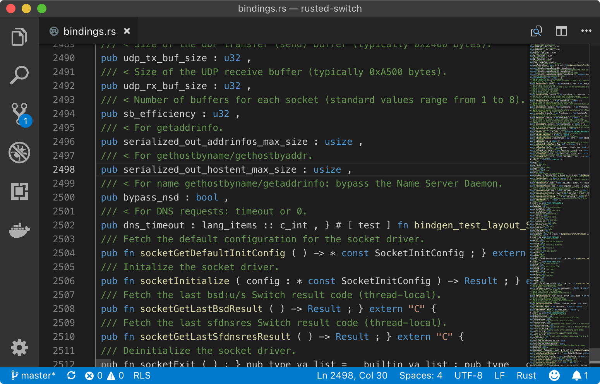

---

##  Igor Borges
<ul>
  <li class="fragment" data-fragment-index="1">Engenheiro Software @ Nubank</li>
  <li class="fragment" data-fragment-index="2">Viciado em testar novas tecnologias</li>
  <li class="fragment" data-fragment-index="3">Banido recentemente da Nintendo Network</li>
  <li class="fragment" data-fragment-index="4">Não sei programar em Rust</li>
</ul>


---

## Criando homebrews para o Nintendo Switch em Rust
## <i class="fab fa-nintendo-switch"></i> 🦀

---

## Um pouco de contexto
<ul>
  <li class="fragment">**3 Março 2017** → <i class="fab fa-nintendo-switch"></i> Nintendo Switch</li>
  <li class="fragment">Sistema de fábrica ↔ sistema modificado</li>
  <li class="fragment">Homebrew → não-oficial, "proibido"</li>
  <li class="fragment">**Janeiro 2018** → indícios exploit (Team Xecuter, Reswitched, and Fail0verflow)</li>
  <li class="fragment">**23 Abril 2018** → Tegra X1 bootrom leak</li>
  <li class="fragment">[SwitchBrew wiki](https://switchbrew.org/wiki/Main_Page)</li>
</ul>

---

## Mais um pouco de contexto
<ul>
  <li class="fragment">**CFW** → Custom Firmwares</li>
  <li class="fragment">[<i class="fab fa-github"></i> Atmosphere-NX/Atmosphere](https://github.com/Atmosphere-NX/Atmosphere)</li>
  <li class="fragment">Userland syscalls</li>
  <li class="fragment">
    [<i class="fab fa-github"></i> switchbrew/libnx](https://github.com/switchbrew/libnx)
    <br />
    [<i class="fab fa-github"></i> reswitched/libtransistor](https://github.com/reswitched/libtransistor)
  </li>
  <li class="fragment"><i class="fas fa-user-ninja"></i> "Hackeei" o Switch</li>
</ul>

---

## Quero mexer com isso!


<small>Vamos dar uma olhada nessas libs.</small>

Note:
- naquela época "pô, legal quero mexer com isso"
- não sei pra vocês, melhor jeito aprender uma tecnologia nova pra mim é fazendo um jogo
- desde criança pegava powerpoint, carrinho mexer, "mãe fiz um jogo"
- vou dar uma olhada nessas libs

---

```c
#include <switch.h>

#define SAMPLECOUNT (SAMPLERATE / FRAMERATE)
#define BPSAMPLE 2

int main(int argc, char **argv) {
    AudioInBuffer *released_in_buffer;

    // Make sure the buffer size is aligned to 0x1000 bytes.
    u32 data_size = (SAMPLECOUNT * CHANNELCOUNT * BPSAMPLE);
    u32 buffer_size = (data_size + 0xfff) & ~0xfff;

    // Allocate the buffers.
    u8* out_buf_data = memalign(0x1000, buffer_size);
```

---

<ul>
  <li>C. Puts.</li>
  <li class="fragment">Alocar/desalocar de memória</li>
  <li class="fragment">Não é funcional, imutável, nem orientada à objetos</li>
  <li class="fragment"><i class="far fa-lightbulb" style="color: yellow;"></i> Vou fazer isso em Rust!</li>
  <li class="fragment"> "Rust Rust Rust"</li>
</ul>

---

## O que temos em mãos
- <i class="fab fa-nintendo-switch"></i> Switch: Tegra X1 SoC (Cortex A57/A53 armv8)
- 🦀 Rust: cross-compiling: [platform support](https://forge.rust-lang.org/platform-support.html)
- <i class="fab fa-github"></i> Lib: [switchbrew/libnx](https://github.com/switchbrew/libnx)

Note:
- não me atentei ao fato de que isso não era uma coisa trivial se fazer
- toolkit em C tava pronto e funcionava bem
- pegava o template Makefile

---

**libnx** → Makefile `aarch64-none-elf`

**Rust** → Tier 2: `aarch64-unknown-linux-gnu`

---

## xargo

[<i class="fab fa-github"></i> japaric/xargo](https://github.com/japaric/xargo)

<small>_The sysroot manager that lets you build and customize `std`_</small>

```json
{
  "abi-blacklist": [
    "stdcall", "fastcall", "vectorcall"
  ],
  "arch": "aarch64",
  "data-layout": "e-m:e-i8:8:32-i16:16:32-i64:64-i128:128-n32:64-S128",
  "linker": "aarch64-none-elf-ld",
  "features": "+a53,+strict-align",
  "panic": "abort"
  ...
}
```

```shell
$ xargo build --target aarch64-none-elf
```
<!-- .element: class="fragment" -->

---

```rust
fn main() {
    println!("Hello, world!");
}
```

```
Compiling rusted-switch v0.0.6 (/Users/igor/Projects/rusted-switch)
error[E0463]: can't find crate for `std`
  |
  = note: the `aarch64-none-elf` target may not be installed

error: aborting due to previous error
```
<!-- .element: class="fragment" -->

---

- `aarch64-none-elf` → bare-metal
- Não existe std → não existe `println!`
- **libnx** only desde o console
- **libnx** é C puro

---

## rust-bindgen

[<i class="fab fa-github"></i> rust-lang/rust-bindgen](https://github.com/rust-lang/rust-bindgen)

<small>_Automatically generates Rust FFI bindings to C (and some C++) libraries_</small>

```rust
include!(concat!(env!("OUT_DIR"), "/bindings.rs"));
```

---



---

```rust
#![no_std]
include!(concat!(env!("OUT_DIR"), "/bindings.rs"));

fn main() {
    unsafe {
        printf("Hello, world!".as_ptr() as *const i8);
    }
}
```

---

```rust
#![no_std]
include!(concat!(env!("OUT_DIR"), "/bindings.rs"));
extern crate panic_abort;
pub mod lang_items;

#[no_mangle] pub extern "C" fn main() {
    unsafe {
        consoleInit(0 as *mut PrintConsole);
        printf("Hello, world!".as_ptr() as *const i8);

        while appletMainLoop() {}

        consoleExit(0 as *mut PrintConsole);
    }
}
```

---

# Demo

---

## Próximos passos
- Gerar um binário pelo Cargo
- **libnx** nativa em Rust
- Fazer meu jogo 😢

---

[<i class="fab fa-github"></i> ischeinkman/libnx-rs](https://github.com/ischeinkman/libnx-rs)

[<i class="fab fa-github"></i> ischeinkman/libnx-rs-template](https://github.com/ischeinkman/libnx-rs-template)

<small>(graphics, touch, conrod)</small>

---

## Referências
- [<i class="fab fa-github"></i> Igor1201/rusted-switch 🦀](https://github.com/Igor1201/rusted-switch)
- [<i class="fab fa-github"></i> ischeinkman/libnx-rs](https://github.com/ischeinkman/libnx-rs)
- [<i class="fab fa-github"></i> ischeinkman/libnx-rs-template](https://github.com/ischeinkman/libnx-rs-template)
- [SwitchBrew wiki](https://switchbrew.org/wiki/Main_Page)
- [devkitPro installation](https://devkitpro.org/wiki/devkitPro_pacman)
- [<i class="fab fa-github"></i> cs140e/rpi3-rust-template](https://github.com/cs140e/rpi3-rust-template)
- [<i class="fab fa-github"></i> rust-embedded/rust-raspi3-tutorial](https://github.com/rust-embedded/rust-raspi3-tutorial)
- [A Freestanding Rust Binary](https://os.phil-opp.com/freestanding-rust-binary/)
- [<i class="fab fa-github"></i> japaric/xargo](https://github.com/japaric/xargo)
- [<i class="fab fa-github"></i> rust-lang/rust-bindgen](https://github.com/rust-lang/rust-bindgen)

---

# Obrigado!

||Igor Borges|
|---|---|
|<i class="fab fa-github"></i>|[github.com/Igor1201](https://github.com/Igor1201)|
|<i class="fas fa-globe-americas"></i>|[borges.me](https://borges.me)|
